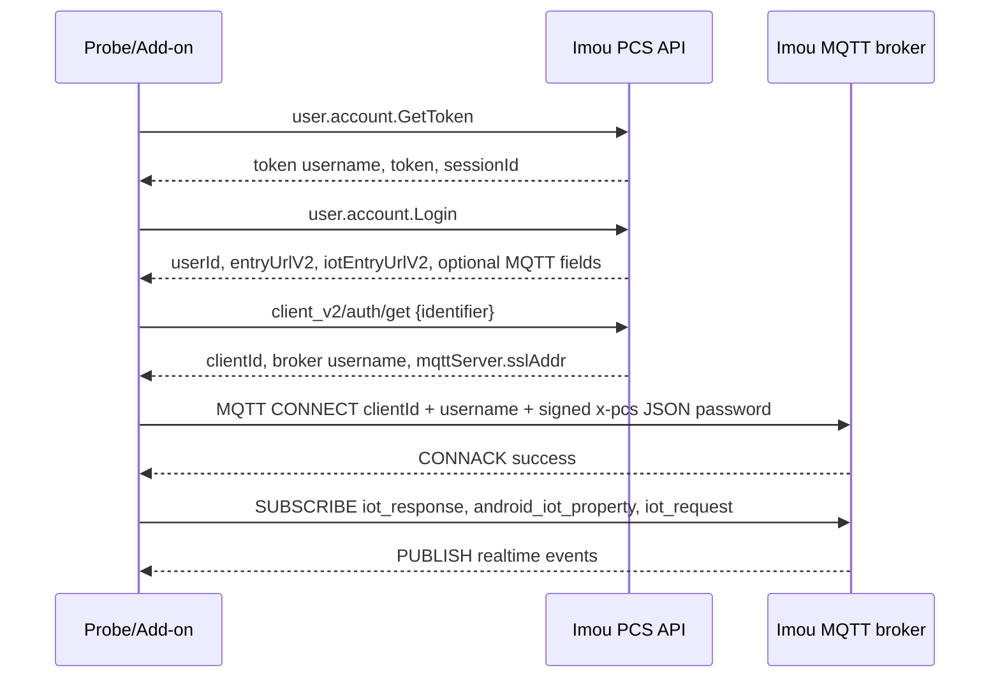

# Imou Cloud MQTT Realtime Events

This document tracks the reverse-engineered Imou cloud MQTT push path used by
the Android app for realtime notifications and device/property events.

This is **not** Home Assistant MQTT discovery. The add-on no longer exposes HA
entities through MQTT. This page is about the vendor cloud push channel that the
Imou app opens after login.

## APK Findings

Relevant decompiled classes:

| Area | APK path | Finding |
| --- | --- | --- |
| Push bootstrap | `Tg/h.java`, `wg/d.java` | The app starts the MQTT push channel during app initialization. |
| MQTT auth API | `Gg/c.java` | Calls `IPushSaasApi.GetMQTTInfo` with an `identifier`. |
| API name | `IPushSaasApi.java` | `GetMQTTInfo = LCApi.POST("client_v2/auth/get", ...)`. |
| Request body | `GetMQTTInfo$RequestData.java` | Only contains `identifier`. |
| Response body | `GetMQTTInfo$ResponseData.java` | Returns `clientId`, `username`, `password`, `salt`, and `mqttServer`. |
| MQTT server model | `MqttServer.java` | Carries `sslAddr` and `tcpAddr`; app prefers TLS. |
| MQTT client | `k7/f.java` | Uses MQTT 3.1.1 and subscribes to app topics after connect. |
| MQTT password | `MQTTHead.java` | MQTT password is a JSON object containing `x-pcs-*` fields plus HMAC-SHA256 signature. |
| Terminal identifier | `m7/d.java` | Uses persisted `sp_mqtt_device_id`, normally Android `ANDROID_ID` or a generated UUID. |

The default app topic map contains:

```text
iot_request
iot_response
android_iot_property
```

`iot_request` is also the topic used when the app publishes request/RPC payloads.
For passive event capture, `iot_response` and `android_iot_property` are the
most interesting topics, but the probe subscribes to all three by default to
match the app.

## Flow



## MQTT CONNECT Authentication

The broker password field is not the account password. The Android app builds a
compact JSON object:

```json
{
  "x-pcs-username": "uuid\\<userId-or-login-username>",
  "x-pcs-nonce": "<32 random chars>",
  "x-pcs-date": "2026-06-30T00:00:00Z",
  "x-pcs-client-ua": "<base64 client UA JSON>",
  "x-pcs-signature": "<base64 hmac-sha256>",
  "x-pcs-conn-type": "main"
}
```

The canonical string for the main connection is:

```text
x-pcs-client-ua:<client-ua>
x-pcs-date:<date>
x-pcs-nonce:<nonce>
x-pcs-username:<uuid-user>
```

The app signs this with HMAC-SHA256. In the decompiled app, the key comes from
the saved auth module password value. The probe defaults to
`md5(md5(accountPassword))`, matching the PCS `GetToken` key used by the current
add-on login flow. If the broker rejects the connection, try the alternate
`--key-mode` values listed below.

## Probe Script

Use the dependency-free raw MQTT probe:

```bash
IMOU_USERNAME='your@email.example' \
IMOU_PASSWORD='your-imou-password' \
python3 scripts/imou_mqtt_probe.py
```

Recommended first run:

```bash
IMOU_USERNAME='your@email.example' \
IMOU_PASSWORD='your-imou-password' \
IMOU_MQTT_LISTEN_SECONDS=300 \
python3 scripts/imou_mqtt_probe.py --topics iot_response,android_iot_property,iot_request
```

Useful options:

| Option / env | Purpose |
| --- | --- |
| `--identifier` / `IMOU_MQTT_IDENTIFIER` | Stable terminal identifier sent to `client_v2/auth/get`. Use the Android `sp_mqtt_device_id` value if comparing with app traffic. |
| `--topics` / `IMOU_MQTT_TOPICS` | Comma-separated topic list. Default matches the app topic map. |
| `--listen-seconds` / `IMOU_MQTT_LISTEN_SECONDS` | How long to keep the MQTT socket open. |
| `--key-mode` / `IMOU_MQTT_KEY_MODE` | HMAC key source. Try `account-password-key`, `plain-password`, `response-password`, `response-salt`, or `session-key`. |
| `--session` | Load an existing token/login JSON instead of doing `GetToken` + `Login`. Requires a signing password through `IMOU_MQTT_SIGNING_PASSWORD` when no `IMOU_PASSWORD` is set. |
| `--raw` | Print MQTT payloads without JSON redaction. |
| `--insecure` | Disable TLS certificate verification for lab interception. |

The script prints JSON lines:

```json
{"step":"mqtt_info","broker":"...:8883","clientId":"...","topics":["iot_response","android_iot_property"]}
{"step":"mqtt_connected"}
{"step":"mqtt_subscribed","topics":["iot_response","android_iot_property"]}
{"step":"publish","topic":"android_iot_property","payload":"{...}"}
```

## Integration Direction

Once the probe confirms live payloads, the add-on can grow a small background
worker:

1. Reuse the add-on account login/session code.
2. Call `client_v2/auth/get` per account with a persisted add-on terminal ID.
3. Hold one MQTT connection per account.
4. Decode incoming `android_iot_property` / `iot_response` payloads.
5. Update in-memory camera status and expose changes through the existing UI,
   ONVIF event hooks, or a local webhook/SSE endpoint.

Keep the cloud MQTT worker separate from Home Assistant MQTT terminology in UI
and docs. A good name is `Cloud realtime events`.

## Open Questions

- Exact payload schema for each event type still needs live captures.
- Whether all regions use the same signing key material is not confirmed.
- App traffic should be compared against the probe for `client-ua`, `identifier`,
  `connect-type`, and key mode if the broker returns non-zero CONNACK codes.
- Some login responses include `mqttAk` / `mqttToken`; those appear to be used
  for stream/sub connections, while the main push connection signs with the
  username path above.
